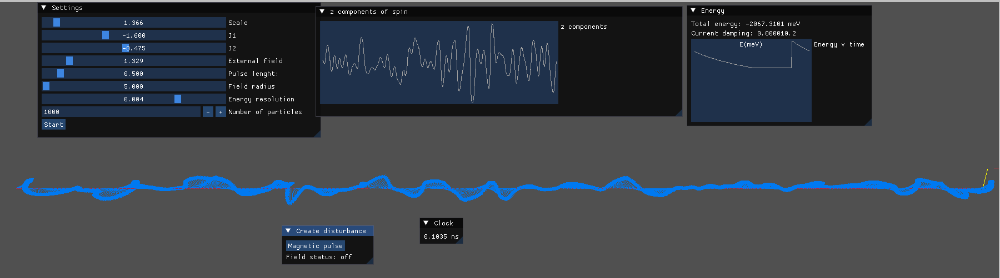
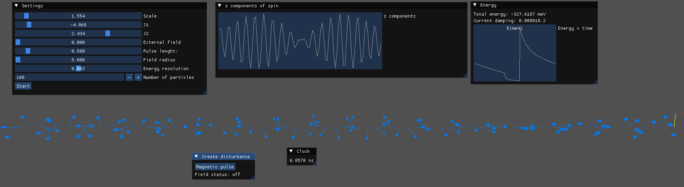
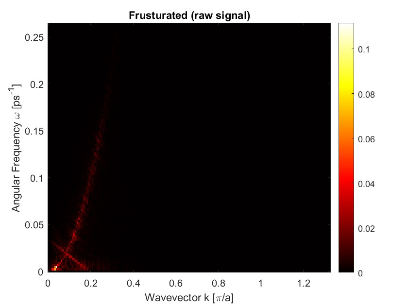
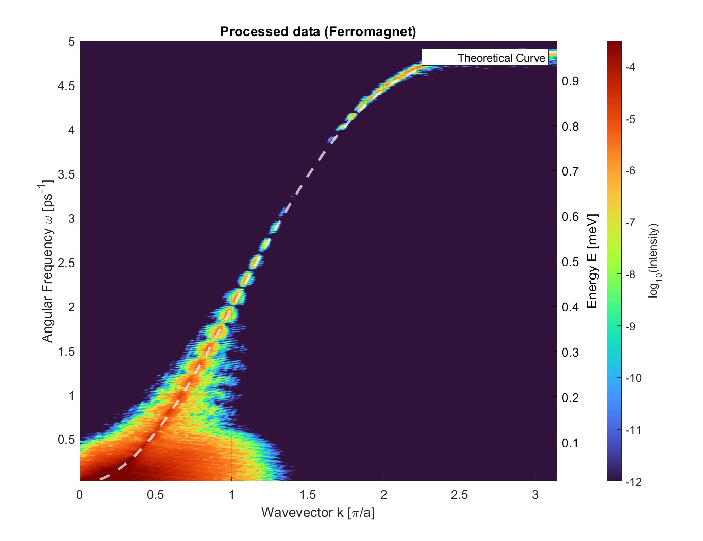
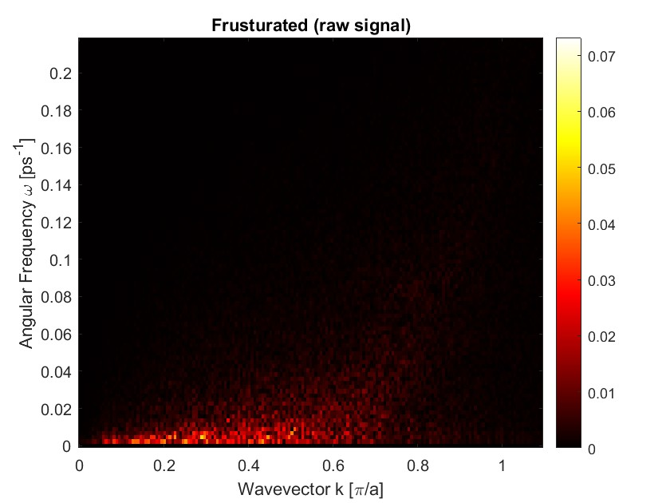
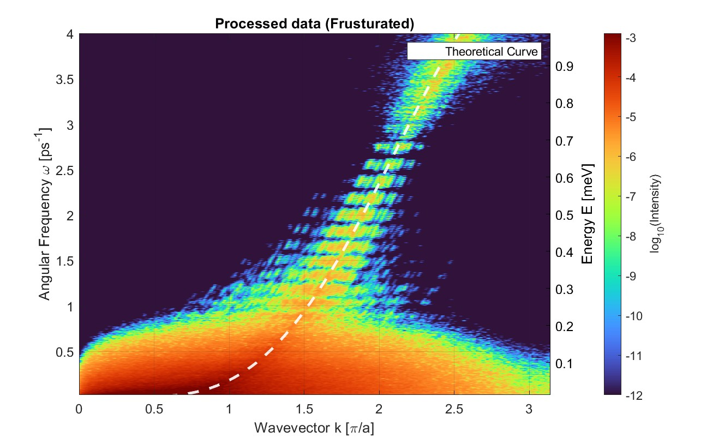
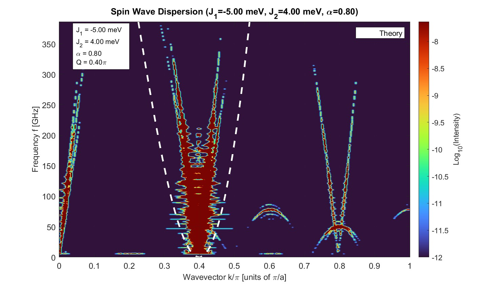
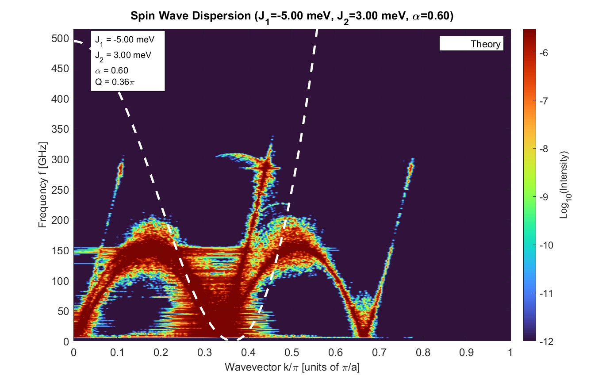

# spinulv0.1
A simulator to predict spin wave dispersion in Heisenberg models. Made for learning purposes. 

## TODO
- Update dependencies
- Add anisotropy term
- Fix energy calculation 

## Method
We use the Heisenberg model to describe a lattice of spins set on discrete sites such that the hamiltonian is
```math
\mathcal{H} = \sum_{i\neq j} J_{i,j}\,\,(S_i \cdot S_j) - \sum_{i} g_i \mu_{B}\,\,(S_i \cdot B_{i}(t))
```

where $S_i \in \mathbb{R}^3$ is the spin vector on the i:th site, $J_{i,j}$ is the coupling factor between the spins on site $i$ and site $j$, $\mu_{B}$ is the Bohr magneton and $g_i$ is the g-factor ($g\approx 2$ to approximate free electrons). $B(t)$ is the flux density of any external magnetic field applied to the system. The time development of each spin vector can then be described by the Landau–Lifshitz equation as
```math
\frac{dS_i}{dt} = -\gamma(S_i \times H_{\text{eff}}) - \gamma \alpha_D \Big( S_i\times (S_i \times H_{\text{eff}}) \Big)
```
where $\gamma$ is the gyromagnetic ratio, $\alpha_D$ is a phenomenological damping constant and $H_{\text{eff}}$ is the effective magnetic field strenght. For the frusturated Heisenberg model we assume that the coupling constant is a function of the distance between the sites: We take into account the nearest neighbours with a coupling factor $J_1$ and the next nearest neighbours with a coupling factor $J_2$. The effective magnetic field strenght at site $i$ is then
```math
H_{\text{eff}} = -\frac{\partial \mathcal{H}}{\partial S_i} \approx -J_1 (S_{i-1} + S_{i + 1}) - J_2 (S_{i-2} + S_{i+2}) + \gamma \mu_B B_{i}(t)
```
For example, an frusturated material like $LiCuVO_4$ could have coupling factors $J_1 \approx -1.6 \text{ meV}$ and $J_2 \approx 0.44 \text{ meV}$: The nearest neigbour coupling is ferromagnetic while the next nearest neighbour coupling is antiferromagnetic, causing a spiral-like ground state structure where all terms of the hamiltonian can't be minimized simultaniously. In the simulation we will find the approximate ground state of the system and introduce an external magnetic field to a disk of some radius in the center of the lattice to initiate a spin wave. We will then look at the components of the spins in the direction of the external field $S_z(i, t)$: By taking a fourier transform of this we should find the dispersion relation $\omega(k)$ and the energy of the magnon. For efficient discrete FFT:s of large matrices we use the [fftw](https://fftw.org/) library.

## Simulation
To calculate the direction of each spin we use the following integrator: For each site calculate $H_{\text{eff}}$, calculate $dS$ for some small time step $dt$. Then add it to the spin and calculate again $dS'$ for a small time step. Then take the normalized average of $dS$ and $dS'$ and add it to the original spin. This is called the predictor-corrector method and I found it to be most numerically stable. The simulation itself consists of two stages: 
- Finding the ground state
- Measuring the spin wave

We initialize the sites and their spins to point in random directions (the planar angle $\theta \sim N(\pi, 1.5)$ and $S_z = 0$). In the first stage we set the damping parameter to a relatively high value ($\alpha_D = 0.4$) to, in essence, suffocate the precessive effects and quickly find a good approximate ground state for the system. The ground state is detected by plotting the collective energy of the system, given by
```math
E = \sum_i J_11(S_i \cdot S_{i+1}) + J_2(S_i \cdot S_{i+2}) - S_i \cdot B_i (t)
```
When this energy remains somewhat constant we have found the ground state.

In the second stage we start the internal clock of the simulation and reduce the damping coefficient and the time step to be very small ($\alpha_D = 0.0005$ and $dt = 0.01 \text{ps}$). This allows for precession and thus observing the spin waves (while keeping some damping to keep the simulation at least somewhat numerically stable). The user can then add an external magnetic field of any flux density affecting in a disk of a fixed radius around the center in the z-direction. This will trigger the plotting of spin components in the z direction. The detection time $T$ is defined by the desired frequency resolution
```math
\Delta \omega = \frac{2\pi}{T}
```
which is set by the user. 

## Visualization

A 3d animation of the spin vectors was created by the open source  [Raylib](https://www.raylib.com/) library as well as a GUI for controlling the parameters and displaying some live plots with the [ImGUI](https://github.com/ocornut/imgui) library. [rlImGui](https://github.com/raylib-extras/rlImGui) was used for the integration of these. Images of visualization
| Ferromagnet, 1000 sites        | Frusturated, 100 sites               |
| ---------------------- | ---------------------- |
|  |  

## Results
A ferromagnet was simulated by choosing $J_1 = -1.6\text{ meV}$ and $J_2 = -0.4 \text{ meV}$. I ended up measuring deviations from the ground state after a magnetic pulse of $B \approx 1.5\text{ mT}$ of length $0.5\text{ ps}$ was applied to a cone in the center. Processing-wise the only steps not happening in Datalogger class were: the heatmap was plotted in log-scale and 2D gaussian smoothing was applied in matlab.

| Raw signal             | Processed               |
| ---------------------- | ---------------------- |
|  |  |


A frusturated system was simulated by choosing $J_1 = -1.6\text{ meV}$ and $J_2 = 0.440\text{ meV}$. Again the deviations from the ground state were measured after a magnetic pulse of $B \approx 1.5 \text{mT}$ was applied for $0.5\text{ ps}$. 
| Raw signal             | Processed               |
| ---------------------- | ---------------------- |
|  |  |


These results were even more noisy. This is likely to a poor stability of the ground state after the damping is removed or the fact that the ground state is not collinear. I tried to combat the latter by measuring the deviation from the ground state in the moment before the pulse is applied but that didn't work. 

To reduce noise I tried an frusturated system that had very high coupling constants. This should result in more stable spirals and less noise so the waves could be observed at much lower frequencies. 
|          |        |
| ---------------------- | ---------------------- |
|  |  |

The signal is clearly less noisy but does not correspod to the theoretical curve very well as there is a linear shift and the parabolic shape seems to be much sharper. The minima however seems to be in the right place. There are sinusoidal looking artifacts in-between the dispersion branches. I suspect these have to do with the boundaries and reflecting waves.   

## Further improvements
- More robust ground state finder
- Also support e.g. 2D triangular lattices
